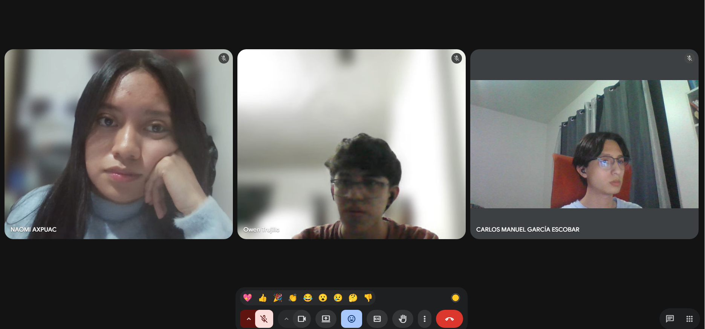

# Actividad Práctica 5: Comunicación Asertiva
**Integrantes:**
1. 202505830 Naomi Rocio Axpuac Velásquez
2. 202506643 Owen Stev Trujillo Cruz
3. 202500132 Carlos Manuel García Escobar

## Desarrollo de la actividad

A continuación se presenta la resolución para la **Tarjeta 2: Dar feedback a un compañero**.

### 1. Analizar los escenarios planteados

* **Situación:** Un integrante del equipo entregó su parte del trabajo, pero está incompleta y tiene varios errores. Esta situación está afectando directamente el avance de todo el grupo.
* **Reto y Objetivo:** Se debe dar retroalimentación al compañero utilizando una técnica adecuada para que el mensaje sea claro, útil y respetuoso, evitando en todo momento que la persona se sienta atacada o desmotivada.

### 2. Identificar el problema comunicativo

El problema comunicativo radica en la necesidad de **corregir un desempeño deficiente sin dañar la relación interpersonal**. Al ser un trabajo en equipo, existe la urgencia de avanzar, lo que puede generar frustración. El desafío es comunicar el desacuerdo (trabajo incompleto/errores) y exigir una solución (que lo corrija) sin utilizar un tono acusatorio que provoque que el compañero se ponga a la defensiva o abandone el grupo.

### 3. Aplicar técnicas de comunicación asertiva

Para abordar a este compañero, se aplicarán las siguientes estrategias solicitadas en la guía:

#### A. Dar retroalimentación utilizando la "Técnica del sándwich"

Esta técnica permite estructurar el mensaje intercalando la crítica constructiva entre dos comentarios positivos.

*  **Capa superior (Positivo / Empatía):**
  > *"Hola Juan, apreciamos mucho que hayas enviado tu parte del documento a tiempo para que el grupo pudiera integrarlo. Valoramos tu compromiso con la fecha de entrega."*

*  **El centro (Área de mejora / El problema real):**
  > *"Sin embargo, al revisar tu aporte notamos que faltan algunos puntos por desarrollar y hay ciertos errores en la sección de ejes centrales. Como el resto del trabajo depende de esta base, actualmente no podemos seguir avanzando."*

*  **Capa inferior (Cierre positivo / Solución colaborativa):**
  > *"¿Te parece si nos conectamos 10 minutos para revisar esos detalles juntos y aclarar cualquier duda? Sé que con unos pequeños ajustes tu parte quedará excelente y podremos terminar el proyecto a tiempo."*

#### B. Practicar decir "no" de forma profesional
*(En caso de que el integrante pida que otro realice su trabajo)*
> *"Entiendo que se te presentaron complicaciones con tu tiempo, pero en este momento no me es posible realizar la parte que te corresponde, ya que debo concentrarme en pulir mis secciones asignadas. Te puedo orientar si tienes alguna duda técnica, pero es necesario que tú completes tu contenido."*

#### C. Negociar límites de manera clara y respetuosa
> *"Entiendo que has estado ocupado, pero necesitamos esa parte completa para hoy a las 5:00 PM como máximo. De lo contrario, nos veremos obligados a reasignar tu parte para no afectar la nota de todos. ¿Podemos contar con tu corrección para esa hora?"*

#### D. Aplicar regulación emocional durante la interacción

* **Tono:** Se mantendrá un tono de voz calmado, profesional y colaborativo, evitando el sarcasmo o la impaciencia.
* **Pausas:** Después de plantear el área de mejora, se hará una pausa para permitir que el compañero asimile la información y exprese su punto de vista o justificación (escucha activa).
* **Control emocional:** Si el compañero reacciona a la defensiva, no se responderá con enojo; se redirigirá la conversación hacia el objetivo en común (entregar un buen trabajo en equipo).

## 4. Evidencia de Trabajo Colaborativo
## Foto de el grupo

## 5. Gestión y Uso de Herramientas Colaborativas

Para el desarrollo estructurado y transparente de esta actividad práctica, el equipo utilizó herramientas de gestión colaborativa y control de versiones, distribuyendo las responsabilidades de la siguiente manera:

### A. Organización del trabajo y asignación de tareas
Se gestionó el flujo de trabajo dentro del repositorio mediante la creación y asignación de *Issues* / tareas para asegurar la participación equitativa de los integrantes:

| Tarea / Issue | Integrante Asignado | Estado | Descripción del Aporte |
| :--- | :--- | :---: | :--- |
| **#1** Análisis de Escenario y Feedback (Sándwich) | Owen Stev Trujillo Cruz | Completado | Redacción del análisis del problema y desarrollo de la técnica del sándwich. |
| **#2** Negociación de Límites y Manejo del "No" | Naomi Rocío Axpuac Velásquez | Completado | Elaboración de la estrategia de negociación y límites profesionales. |
| **#3** Conclusiones y Estructuración del Markdown | Carlos Manuel García Escobar | Completado | Redacción de conclusiones de aprendizaje y consolidación final del archivo .md |

---

## 6. Conclusión

La aplicación práctica de las técnicas de comunicación asertiva demuestra que la gestión de inconvenientes en el trabajo colaborativo debe enfocar la crítica hacia las soluciones y no hacia las personas. A través de la implementación de la *Técnica del Sándwich* y el establecimiento claro de límites profesionales, es posible corregir desviaciones en entregas incompletas manteniendo la motivación del equipo, asegurando el cumplimiento de las metas académicas o laborales sin comprometer el clima de respeto y profesionalismo.

---
 

